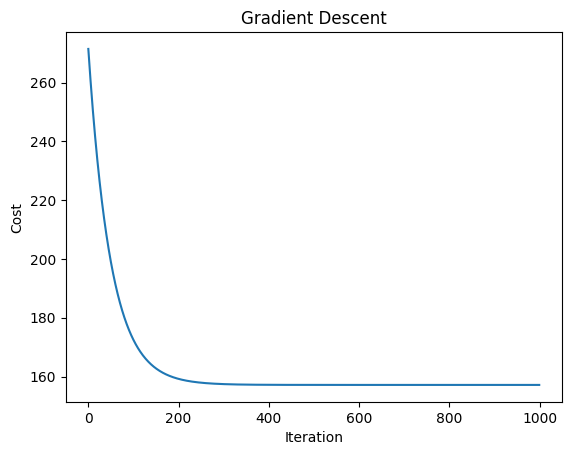
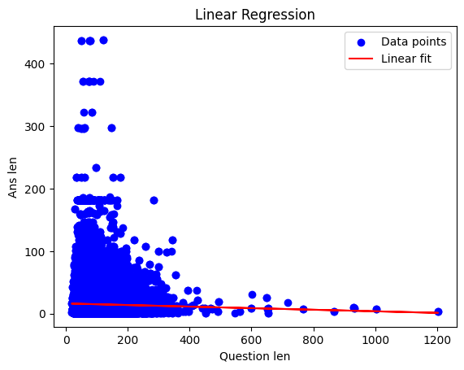
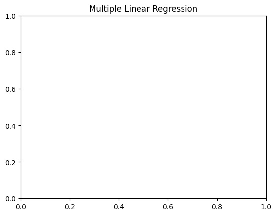
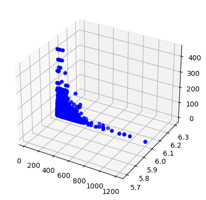

# Gradient Descent and Regression Demo

It is a class assignment to demonstrate the gradient descent algorithm and linear regression models.

## Figures

### 1. Gradient Descent Cost Progression

### 2. Simple Linear Regression

### 3. Multiple Linear Regression - 2D View

### 4. Multiple Linear Regression - 3D View

## Description

- **Gradient Descent**: Shows the progression of the cost function over iterations.
- **Simple Linear Regression**: Plots the data points and the linear regression fit.
- **Multiple Linear Regression - 2D View**: Shows a 2D scatter plot and the linear regression line for multiple features.
- **Multiple Linear Regression - 3D View**: Visualizes the multiple linear regression model in 3D space.

## Personal Information

- Name: Aarab Nishchal
- Roll Number: 2205782
- Batch: B.Tech (2022)
- Branch: Computer Science and Engineering

## Dataset

You can find the dataset used for this assignment [here](https://huggingface.co/datasets/mandarjoshi/trivia_qa).
